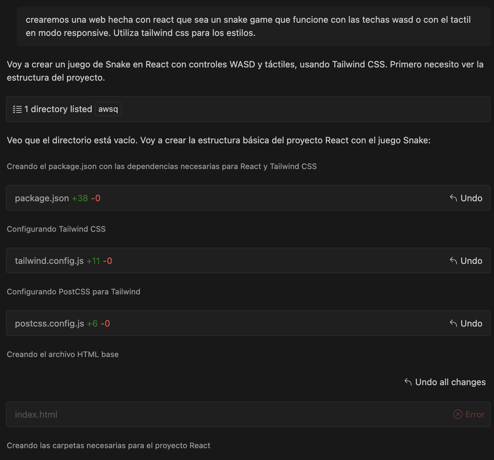
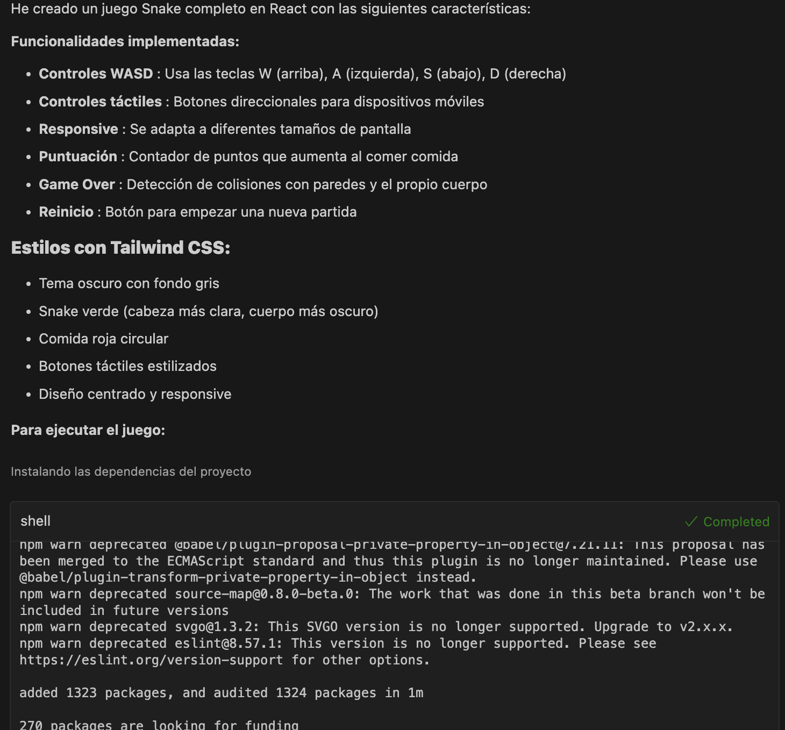
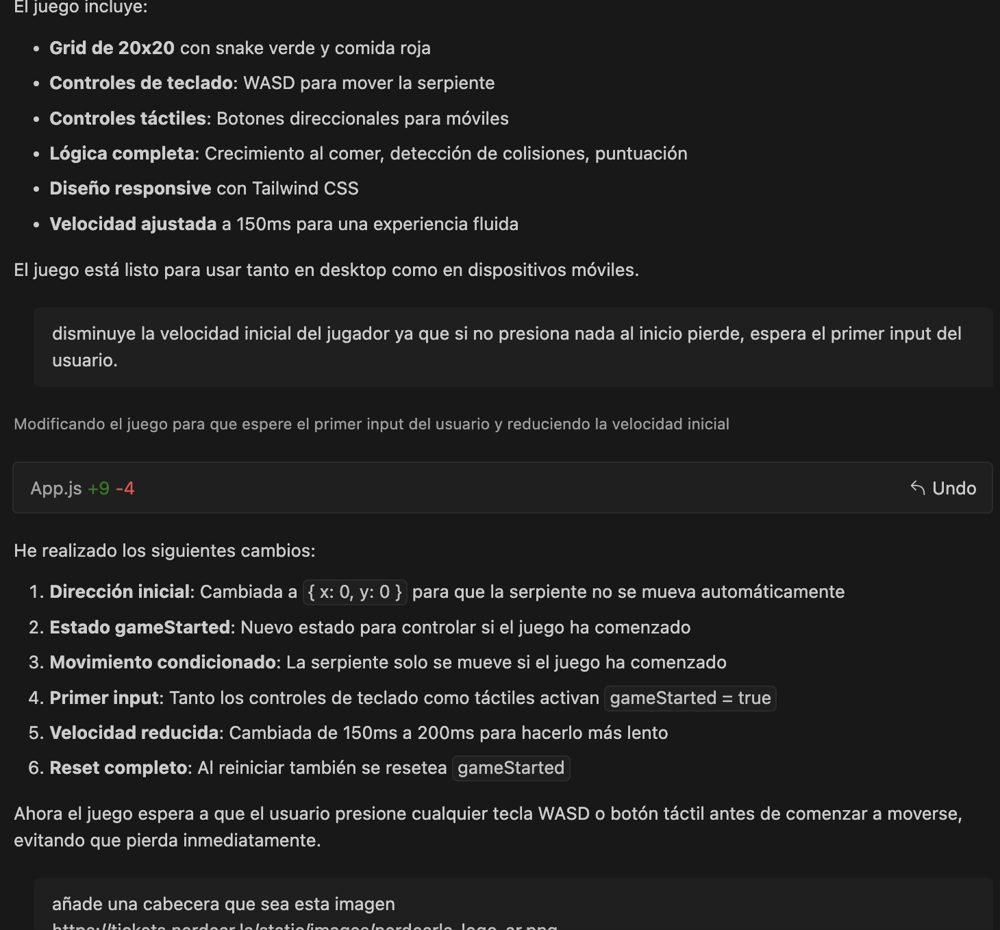
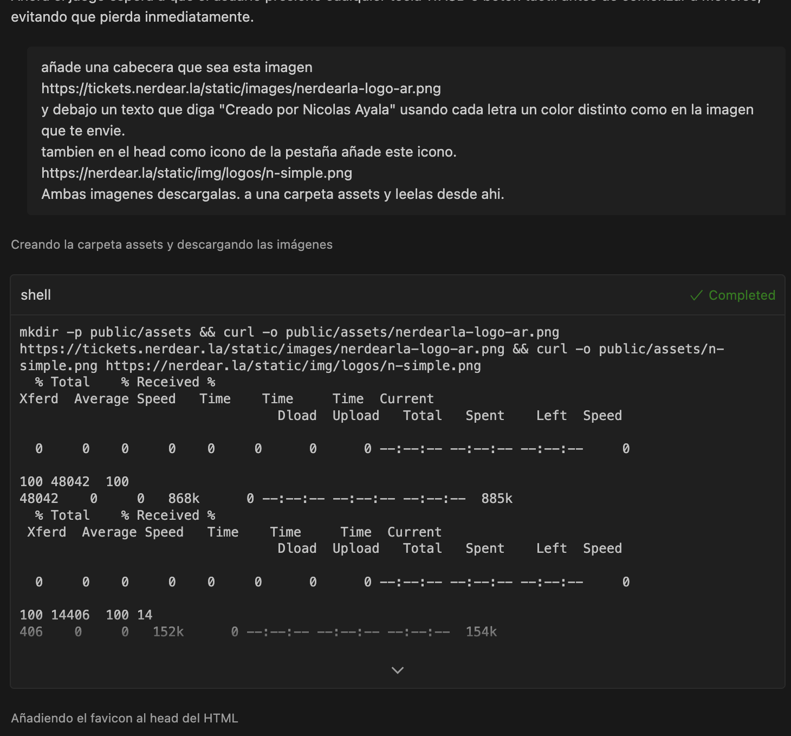
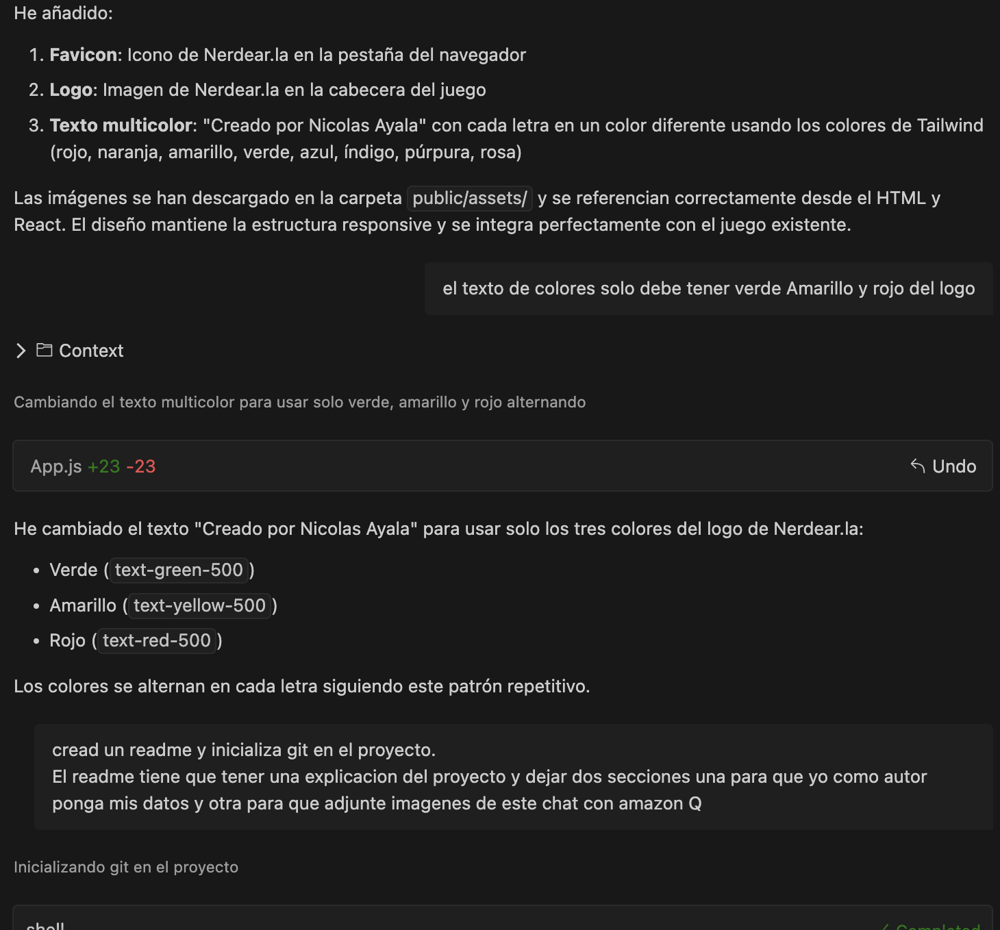
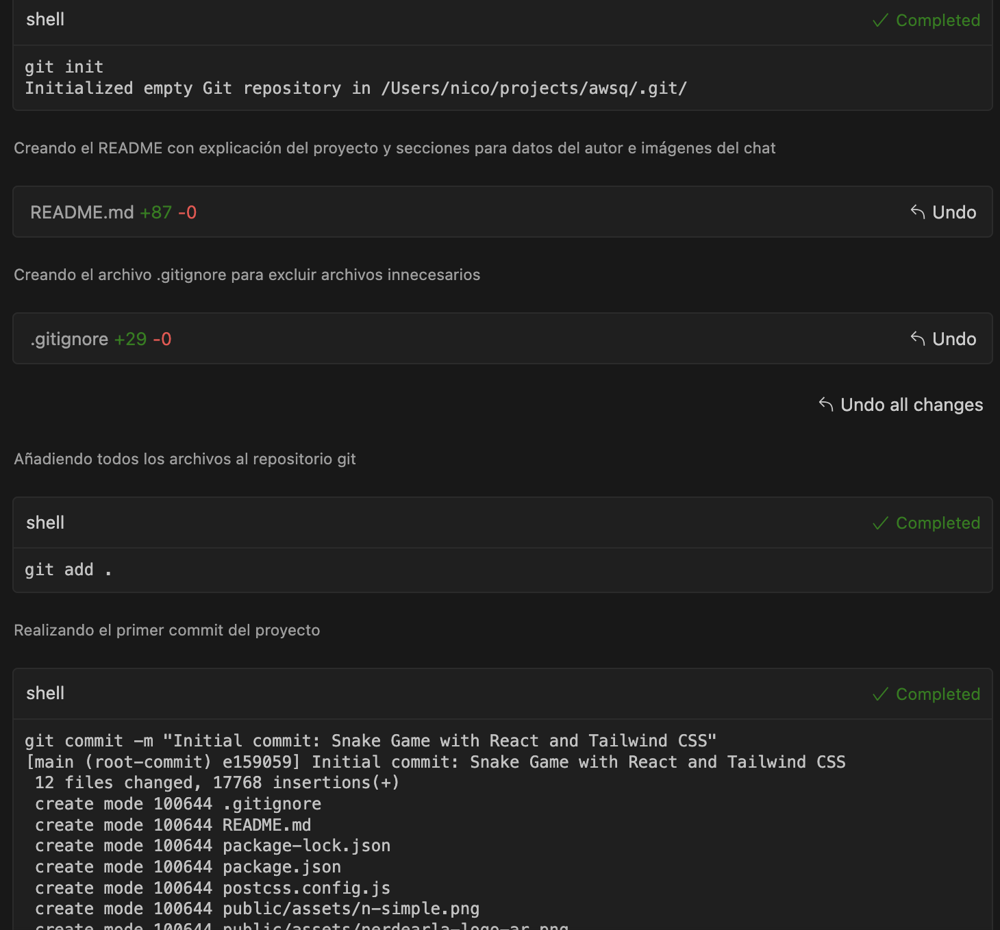
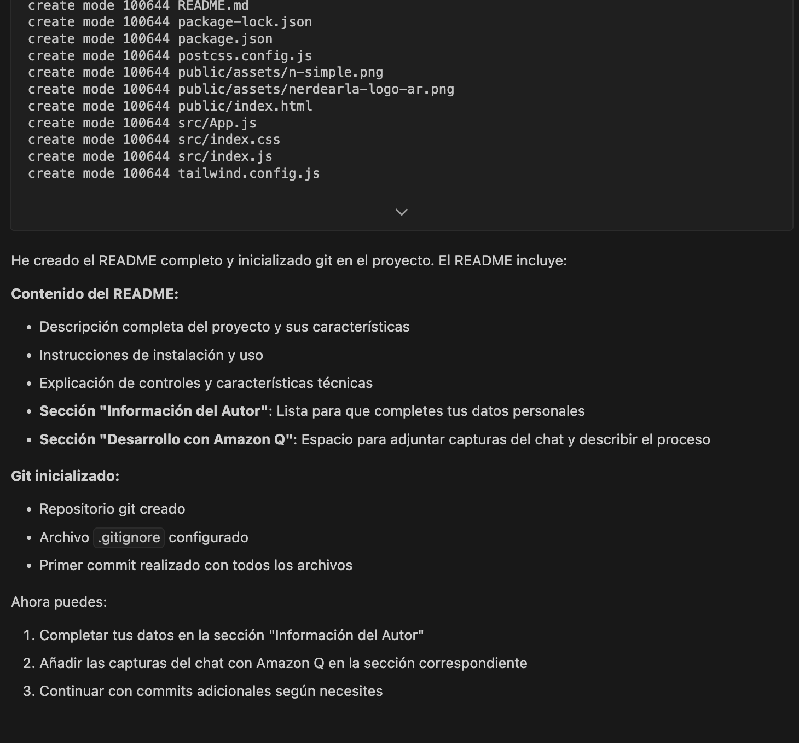

# Snake Game - React

🎮 **[JUGAR DEMO](https://nickolaz.github.io/aws-nerdearla/)**

Un juego clásico de Snake desarrollado en React con controles táctiles y de teclado, estilizado con Tailwind CSS.

## Descripción del Proyecto

Este proyecto es una implementación moderna del clásico juego Snake, desarrollado completamente en React. El juego incluye:

- **Controles duales**: Funciona tanto con teclas WASD como con controles táctiles para dispositivos móviles
- **Diseño responsive**: Se adapta perfectamente a diferentes tamaños de pantalla
- **Interfaz moderna**: Utiliza Tailwind CSS para un diseño limpio y atractivo
- **Lógica completa**: Incluye detección de colisiones, sistema de puntuación y reinicio de partida
- **Experiencia optimizada**: El juego espera el primer input del usuario antes de comenzar

## Características Técnicas

- **Framework**: React 18
- **Estilos**: Tailwind CSS
- **Controles**: WASD (teclado) + botones táctiles
- **Grid**: 20x20 celdas
- **Velocidad**: 200ms por movimiento
- **Responsive**: Compatible con desktop y móvil

## Instalación y Uso

```bash
npm install
npm start
```

El juego se ejecutará en `http://localhost:3000`

## Deployment a GitHub Pages

```bash
npm run deploy
```

Esto creará automáticamente el build y lo subirá a GitHub Pages.

## Controles

- **W**: Mover arriba
- **A**: Mover izquierda  
- **S**: Mover abajo
- **D**: Mover derecha
- **Botones táctiles**: Para dispositivos móviles

---

## Información del Autor

<!-- Sección para que el autor complete sus datos -->

**Nombre**: Nicolas Ayala  
**Email**: eduardoayalakoy@gmail.com
**LinkedIn**: https://www.linkedin.com/in/nickolaz/
**GitHub**: https://github.com/nickolaz

---

## Desarrollo con Amazon Q

Este proyecto fue desarrollado con la asistencia de Amazon Q Developer. A continuación se muestran capturas del proceso de desarrollo:

<!-- Sección para adjuntar imágenes del chat con Amazon Q -->

### Capturas del Chat con Amazon Q

[Adjunta aquí las imágenes del chat mostrando el proceso de desarrollo]










### Proceso de Desarrollo

- Creación de la estructura inicial del proyecto React
- Implementación de la lógica del juego Snake
- Integración de controles WASD y táctiles
- Diseño responsive con Tailwind CSS
- Optimizaciones de velocidad y experiencia de usuario
- Personalización con branding de Nerdear.la

---

## Licencia

Este proyecto es de código abierto y está disponible bajo la licencia MIT.